# Canny Edge Detection

This repository is a submittion towards Programming Assignment 1 of CAP5415 - 22Fall 0V61

The detailed implementation of Canny Edge Detection in [canny_edge notebook](canny_edge.ipynb)
This notebook is also available in .py format at [canny_edge.py](canny_edge.py)

### Notebook 
The notebook goes through each step of Canny Edge Detection in each cell and the results are summarised in the notebook. 

### Python file
The python file takes the following as command line arguments

1) --img_path (str): the path where the image is stored
2) --sigma (float): the intensity of the gaussian blur
3) --LTR (float): Low Threshold Ratio for Double Threshold Hysterisis
4) --HTR (float): High Threshold Ratio for Double Threshold Hysterisis

```bash
python canny_edge.py --img_path data/67079.jpg --sigma 2.5 --LTR 0.1 --HTR 0.2
```
## Results
### Parameters
Sigma = 1.4
LTH = 0.15
HTR = 0.2
### Original image 

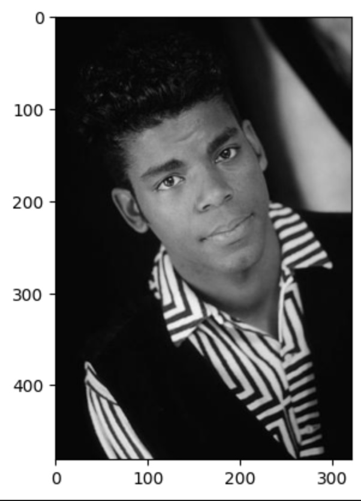
<table>
 <tr>
  <td align="center"></td>
  <td align="center">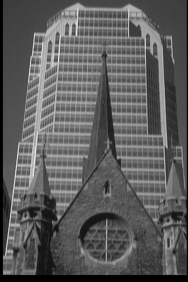</td>
  <td align="center">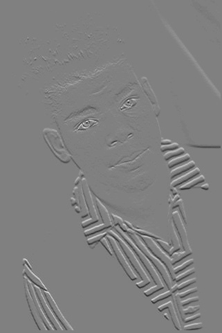</td>
 </tr>
 <tr>
  <td align="center">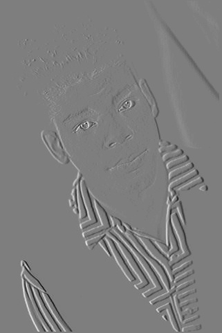</td>
  <td align="center">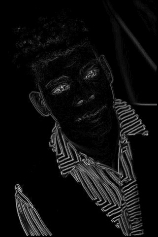</td>
  <td align="center">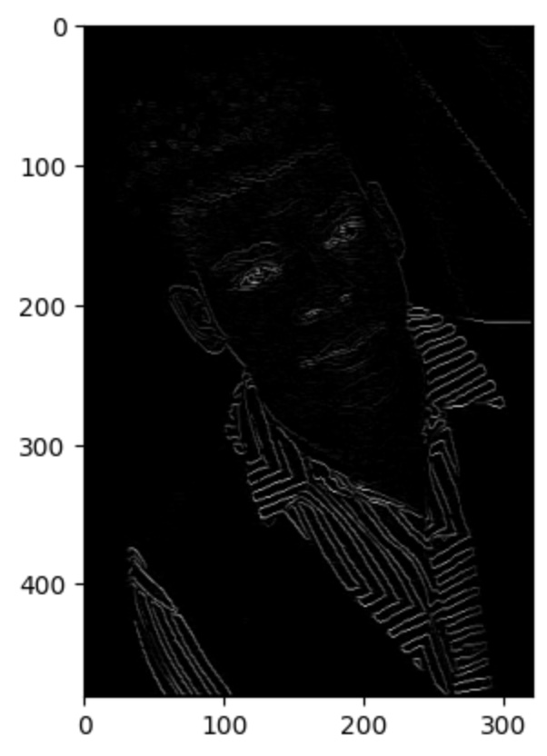</td>
 </tr>
</table>
### Gaussian filter
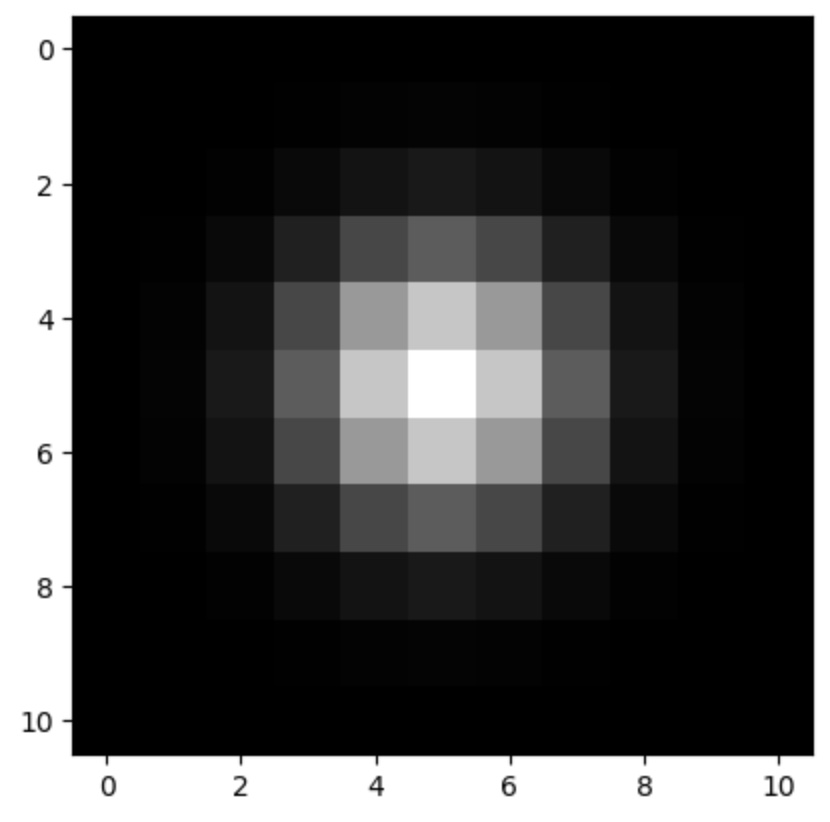
### Original image with gaussian filter
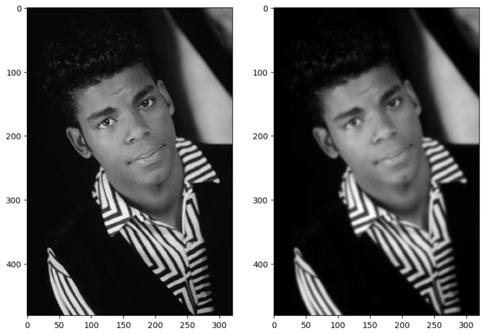
### gaussian derivative mask in x and y direction
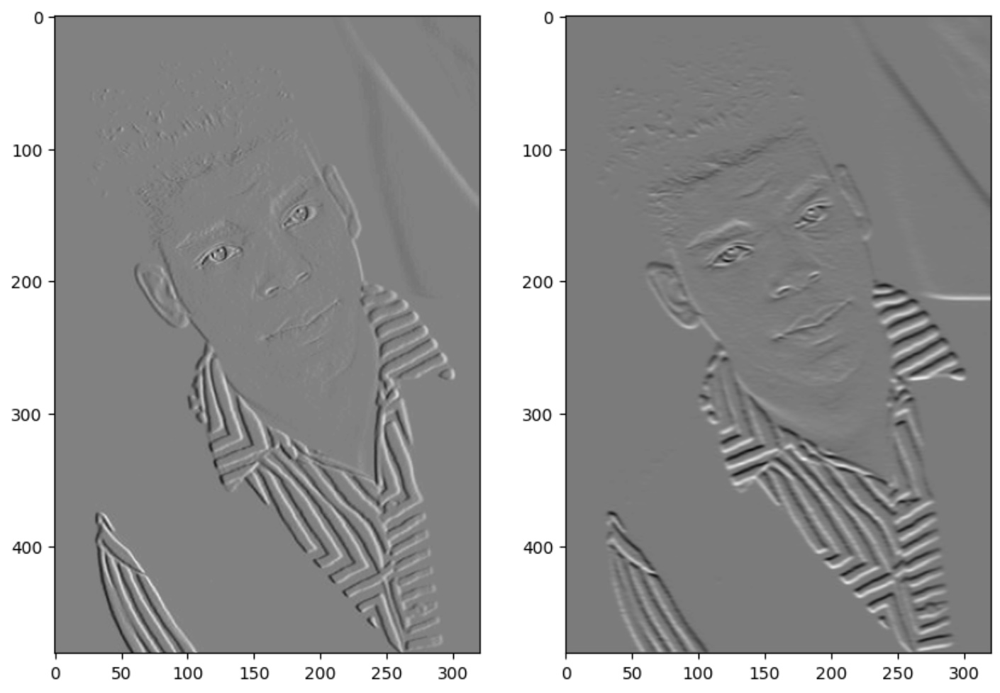
### Magnitude and Orientation of the image
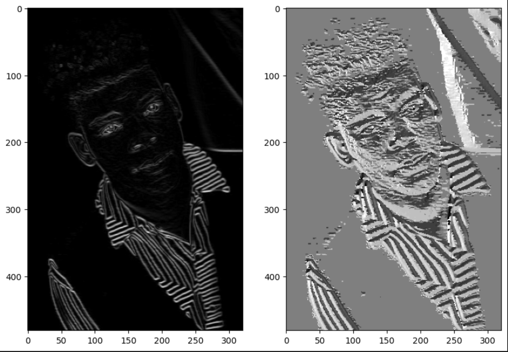

### Non-Max Supression

### Double Threshold Hysterisis
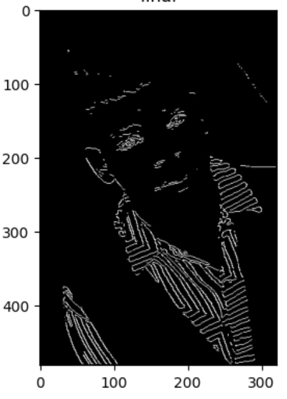
### Image 1
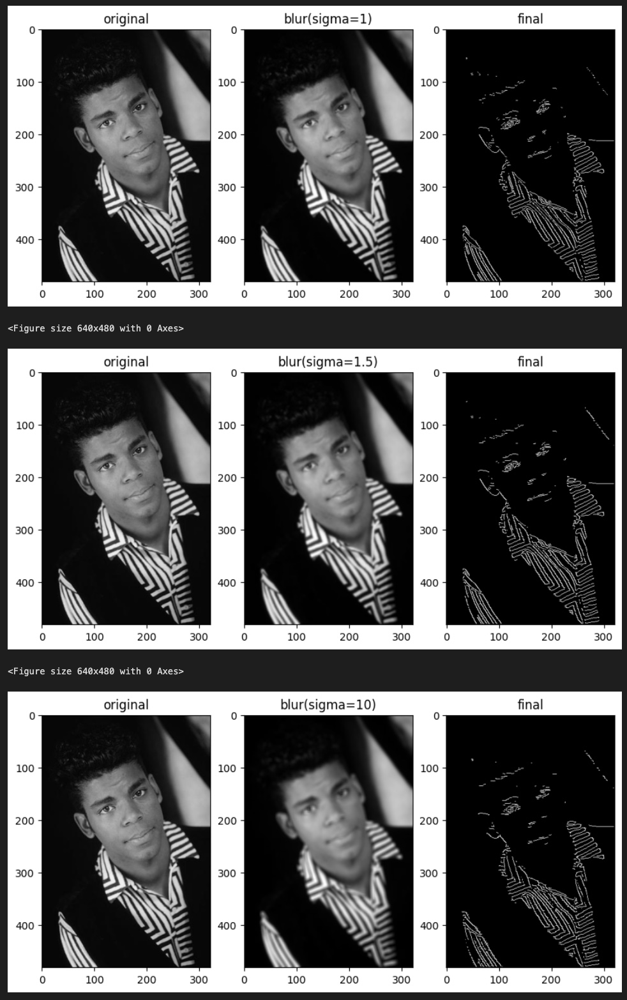
The best sigma value is **sigma=1.5** because it eliminates suitable amount of some noise while retaining almost all important edges unlike **sigma=10**
### Image 2s
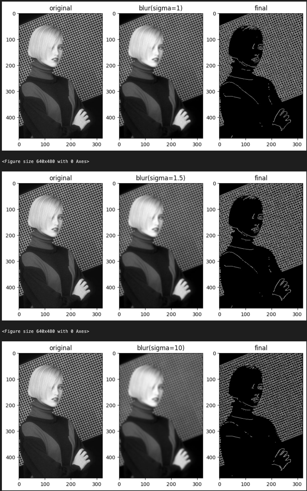
**sigma=1** is the best parameter here, as sigma is increased, the details of the person in the foreground are decreasing as well
### Image 3
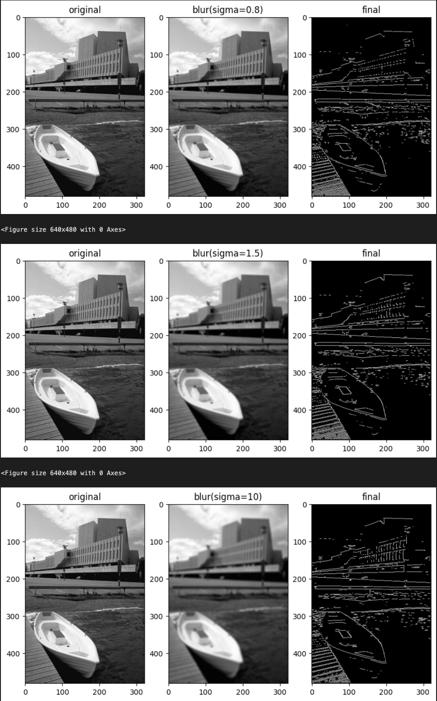
Here the best **sigma=1.5** retains the edges of the building int he background while keeping the details of the boat in the foreground intact
### Image 4
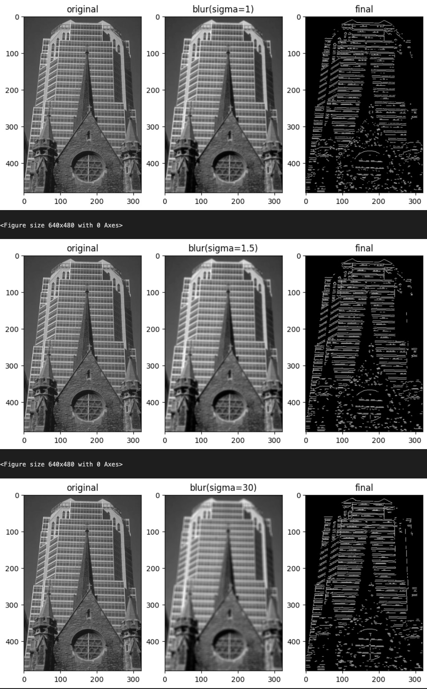
In this image **sigma=1.5** is the best since it retains sharp edges and most details